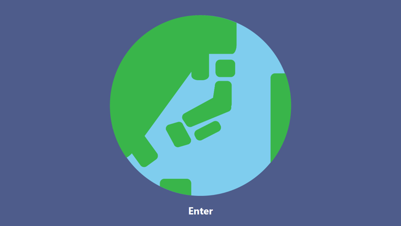
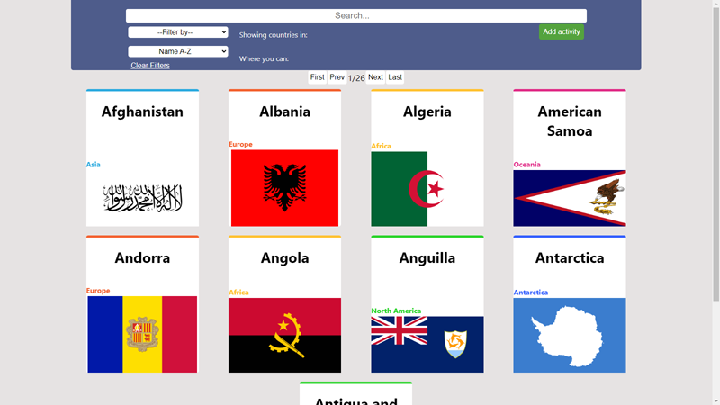
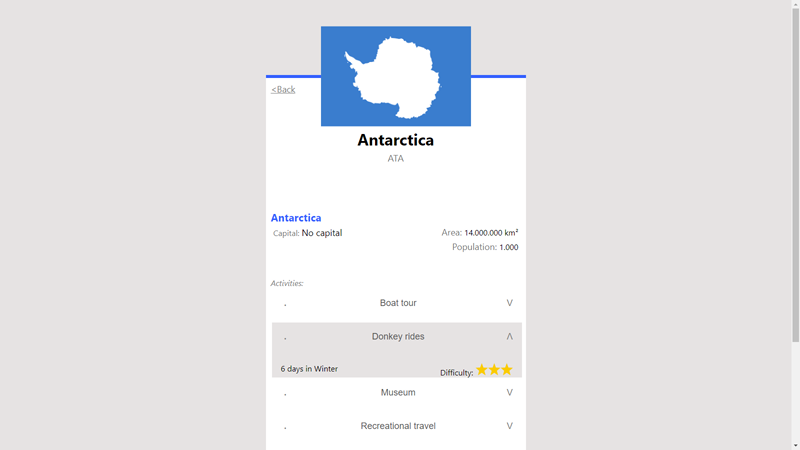
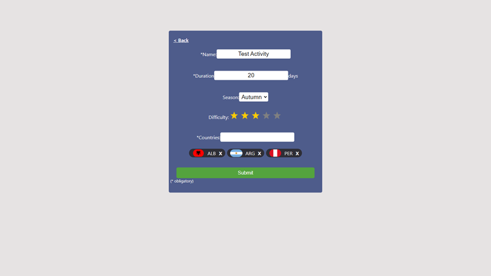

    

# [Countries App](http://164.92.217.102/ "Countries App")

Individual academic project developed over a period of 3 weeks .It consumes the [restcountries API ](https://restcountries.com/ "restcountries API ")and features pagination, filtering, ordering, multiples routes and the possibility of adding tourism activities to each country.

#### Objectives

- Develop a full-fledged app using React, Redux, NodeJs and Sequelize
- Solidify concepts learnt during the HENRY bootcamp
- Learn best practice
- Develop Unit Testing
- Don¨t use any styling library/framework (eg: Bootstrap, Material, etc)

#### Technologies

-  React
- Redux
- Express
- Sequelize - PostgreSQL

#### Screenshots

    

    

    

    

